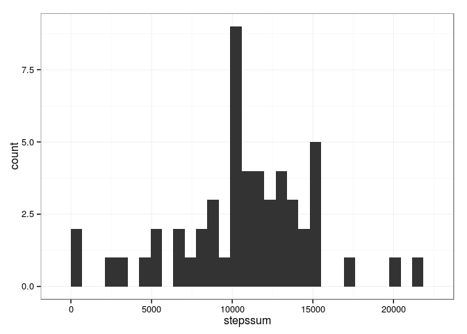
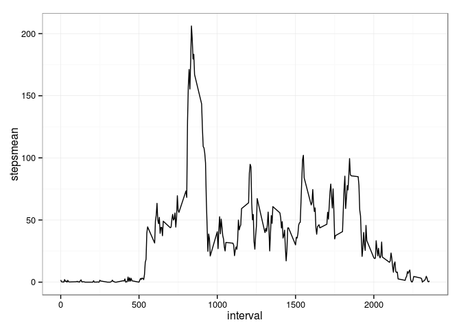
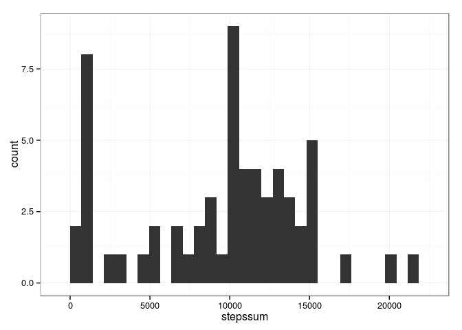
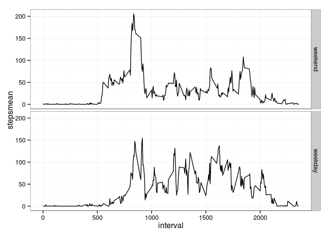

# Reproducible Research: Peer Assessment 1


## Loading and preprocessing the data

```r
library(data.table)
library(ggplot2)

data <- fread('activity.csv')
data.sub <- na.omit(data)
data.sub.perday <- data.sub[,.(stepssum=sum(steps)),date]
```


## What is mean total number of steps taken per day?

```r
ggplot(data.sub.perday, aes(stepssum)) + geom_histogram() + theme_bw()
```

```
## stat_bin: binwidth defaulted to range/30. Use 'binwidth = x' to adjust this.
```



```r
mean(data.sub.perday$stepssum)
```

```
## [1] 10766.19
```

```r
median(data.sub.perday$stepssum)
```

```
## [1] 10765
```


## What is the average daily activity pattern?

```r
data.sub.perinterval <- data.sub[,.(stepsmean = mean(steps), stepsmedian = median(steps)),interval]
ggplot(data.sub.perinterval, aes(interval, stepsmean)) + geom_line() + theme_bw()
```



```r
data.sub.perinterval[which.max(data.sub.perinterval$stepsmean)]
```

```
##    interval stepsmean stepsmedian
## 1:      835  206.1698          19
```


## Imputing missing values

```r
data.na <- data[which(is.na(data$steps))]
data.merged <- merge(data.na, data.sub.perinterval, by='interval')
data.merged[,steps:=floor(data.merged$stepsmedian)]
data.merged[,stepsmean:=NULL]
data.merged[,stepsmedian:=NULL]
data.imput <- rbind(data.sub, data.merged)
```
Do these values differ from the estimates from the first part of the assignment? What is the impact of imputing missing data on the estimates of the total daily number of steps?


```r
data.imput.perday <- data.imput[,.(stepssum=sum(steps)),date]
ggplot(data.imput.perday, aes(stepssum)) + geom_histogram() + theme_bw()
```

```
## stat_bin: binwidth defaulted to range/30. Use 'binwidth = x' to adjust this.
```



```r
mean(data.imput.perday$stepssum)
```

```
## [1] 9503.869
```

```r
median(data.imput.perday$stepssum)
```

```
## [1] 10395
```

## Are there differences in activity patterns between weekdays and weekends?

```r
Sys.setlocale("LC_TIME", "C")
```

```
## [1] "C"
```

```r
data.imput$date <- as.Date(data.imput$date, "%Y-%m-%d")
weekdays.names <- c('Monday', 'Tuesday', 'Wednesday', 'Thursday', 'Friday')
data.imput[,dayofweek:=factor((weekdays(.SD$date) %in% weekdays.names), 
           levels=c(TRUE, FALSE), labels=c('weekend', 'weekday'))]

data.imput.perinterval.perdayofweek <- data.imput[,.(stepsmean = mean(steps)), .(interval, dayofweek)]
ggplot(data.imput.perinterval.perdayofweek, aes(interval, stepsmean)) + geom_line() + facet_grid(dayofweek~.) + theme_bw()
```



